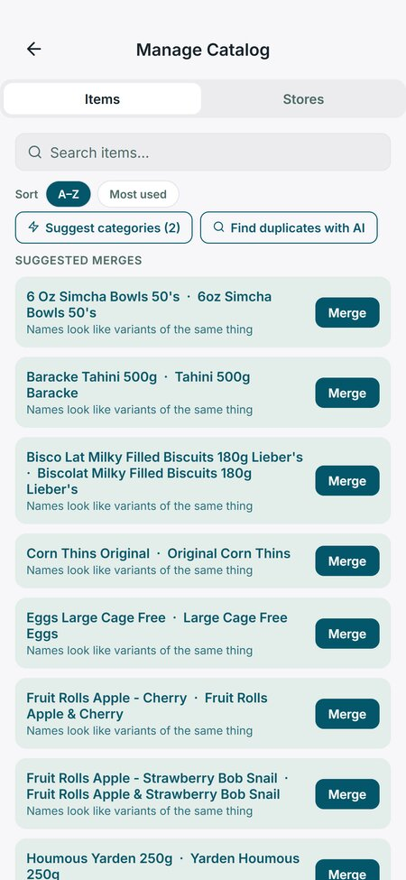
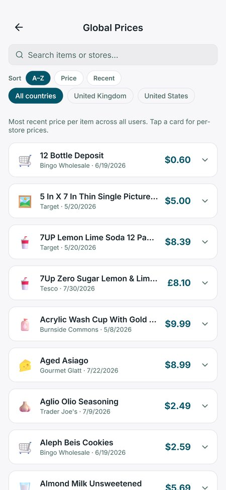

# TimetoPay — Admin Guide

> Administrator-only reference for TimetoPay. These tools are visible only to the master admin and cover the cross-user catalog, user management, board moderation, and global pricing. Keep this document restricted to administrators.

---

## 1. Admin tools overview

Admin features are visible only to the master admin account. When you're signed in as the admin, extra links appear at the bottom of the Account screen: All users, Global prices, Manage catalog, and Board moderation. Everything below lives behind those links.

- Open the Account screen and scroll to the admin links at the bottom.
- These links (and the data behind them) never appear for regular users.
- Cross-user data is read-only except for the catalog and user-management actions described below.

## 2. All users

The All users screen is a directory of every account, showing each user's receipt count, store visits, items tracked, and lifetime spend so you can spot active or inactive accounts at a glance.

- Use the search bar to filter the list by email address.
- Scan the Receipts / Stores / Items stats on each card to gauge engagement.
- Tap any user card to open their detailed management screen.

## 3. User management

Opening a user shows their full receipt history plus the controls to manage that account: change their role, merge them into another account, or delete them entirely. Destructive actions ask for confirmation.

- Change the role between Master admin, Family, or General — promoting to Master admin transfers admin rights in one step and asks you to confirm.
- Use “Merge into another user” to move all of this account's receipts, stores, and items into a target account, then remove the source.
- Use Delete user in the danger zone to permanently remove the account and all its data.

## 4. Manage catalog

The Manage catalog screen keeps the shared product and store database clean. Switch between the Items and Stores tabs to rename, merge, split, categorize, and brand the canonical entries every user's prices roll up into.

- Tap “Suggest categories” to let AI bulk-assign departments to uncategorized items, then accept or reject each suggestion.
- Tap “Find duplicates” to have AI group near-identical names; accept a group to merge it into one canonical entry (the non-AI matcher also flags obvious duplicates automatically).
- On the Stores tab, edit a store to upload a logo or add a website — both then show on the store's detail screen for every user.

## 5. Global prices

Global prices is a cross-user market view of the most recent price recorded for every catalog item, so you can track variance and inflation across stores. It shows aggregates only — never who bought what.

- Tap an item card to expand a ranked list of prices from every store it's been scanned at.
- The “Lowest” badge marks the cheapest store for that item.
- Sort by A–Z, Price, or Recent to surface the data you need.

## 6. Board moderation

New Community Board posts and replies wait for approval before anyone else sees them, and reports from users land in a separate queue for you to act on.

- Open Board moderation to approve or reject pending posts and replies — rejecting removes it without saving a copy.
- Toggle “Auto-approve” for a user you trust so their future posts skip the queue and go live immediately.
- Reports from users appear separately, newest first, with the reason and the reported content. Resolving one just clears it from the queue — if the content itself needs to go, remove it the normal way from the Board.

---

_Generated for TimetoPay administrators. Admin tools appear only for the master admin account._
