# TimetoPay — How-to Guide

> Scan receipts, track prices over time, and let your shopping list build itself. This guide walks through every part of TimetoPay with screenshots from the app.

---

## 1. Signing in

TimetoPay keeps each person's data private, so you start by signing in. Your receipts, stores, and prices are only ever visible to your own account.

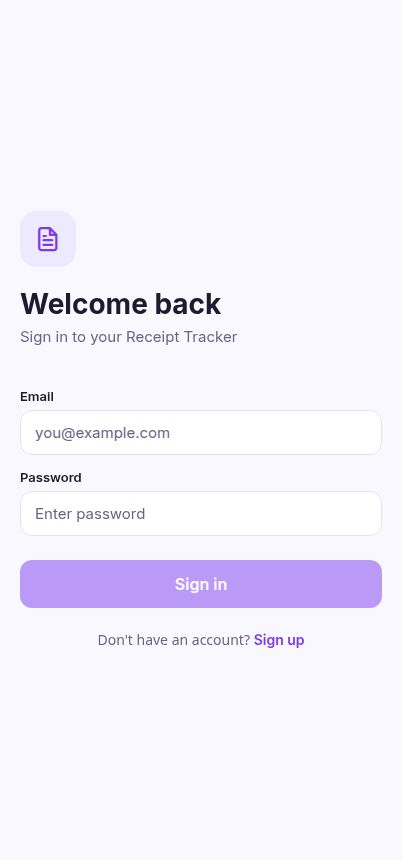

- Enter your email and password, then tap Sign in.
- New here? Tap Sign up to create an account in a few seconds.
- You can sign out any time from the Account screen to switch accounts.

## 2. Your receipts

The Receipts tab is your home base — every receipt you scan or enter shows up here, newest first, with the store and total.

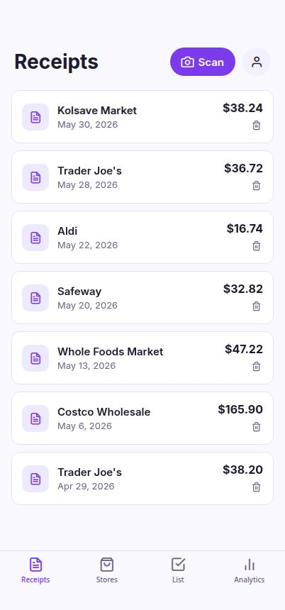

- Tap any receipt to open it and see the individual line items.
- The total on the right is calculated from the items on that receipt.
- Use the search box and Sort control at the top to find or reorder your receipts.
- Use the trash icon to remove a receipt you no longer need.

## 3. Receipt details

Open a receipt to review what was bought. This is where you fix anything the scanner misread.

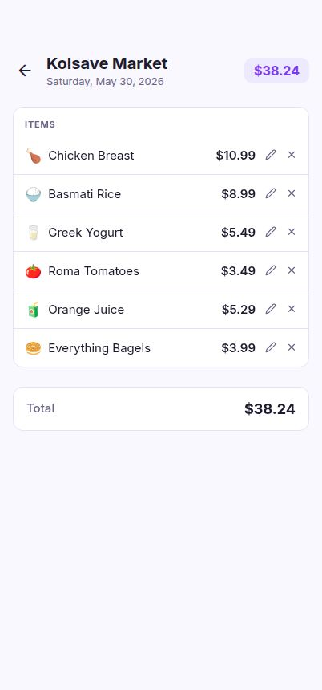

- Tap the pencil on a line to edit its name or price.
- Tap the × to delete a single item from the receipt.
- Each item carries an emoji and feeds your price history automatically.

## 4. Adding a receipt

Tap Scan (or Add Receipt) to capture a new purchase. AI reads the store, items, and prices for you.

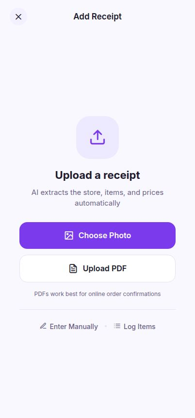

- Choose Photo to snap or upload a paper receipt — the AI extracts everything.
- Upload PDF works best for online order confirmations.
- Prefer to type? Use Enter Manually for a full receipt or Log Items for a quick list.

## 5. Review & save a scan

After the AI reads a photo or PDF, you land on the Review screen to confirm everything before it's saved. Anything the AI wasn't sure about is highlighted in amber.

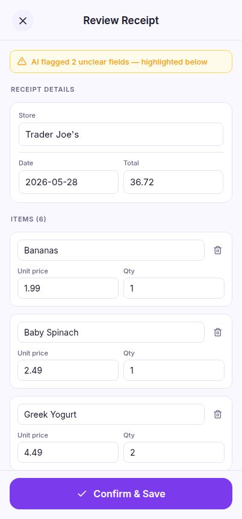

- Check the store, date, and total at the top, then fix any highlighted fields.
- Edit item names, prices, and quantities; remove a line with the trash icon or add one with Add Item.
- Tap Confirm & Save to file the receipt and update your prices and shopping list.

## 6. Enter a receipt manually

No photo? Choose Enter Manually to type a full receipt yourself — handy for cash purchases or older receipts.

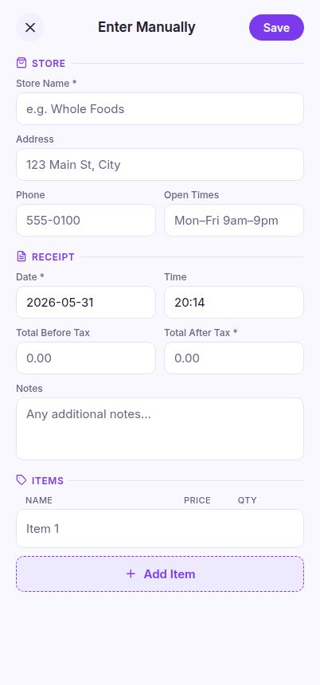

- Fill in the store details and the receipt date, time, and totals.
- Add each item with its name, price, and quantity using Add Item.
- Tap Save to file it just like a scanned receipt.

## 7. Quickly log items

Log Items is the fastest way to jot down a few things — just a store, a date, and a short list. The total adds itself up as you go.

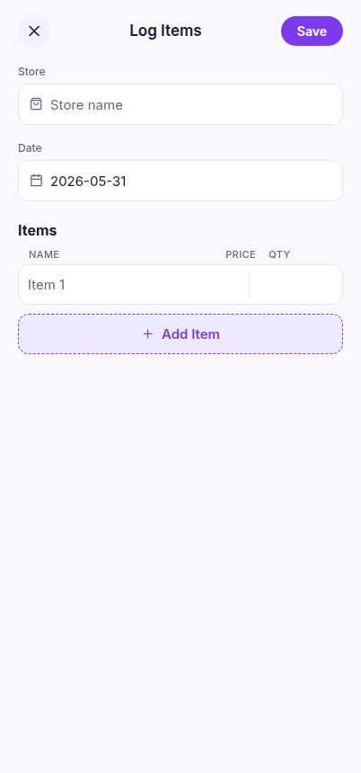

- Start typing a store name and pick from the suggestions, or enter a new one.
- Add each item with its price and quantity; the running total updates live.
- Tap Save to turn the list into a receipt.

## 8. Stores

The Stores tab keeps the places you shop, along with delivery fees and minimum-order details.

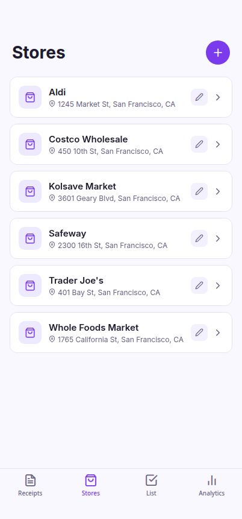

- Tap + to add a store, or the pencil to edit one.
- Record delivery fee and minimum order to power the cost-benefit analysis.
- Tap a store card to open its detail screen.

## 9. Store cost-benefit

Each store's detail screen shows how much you spend there and whether delivery is worth it.

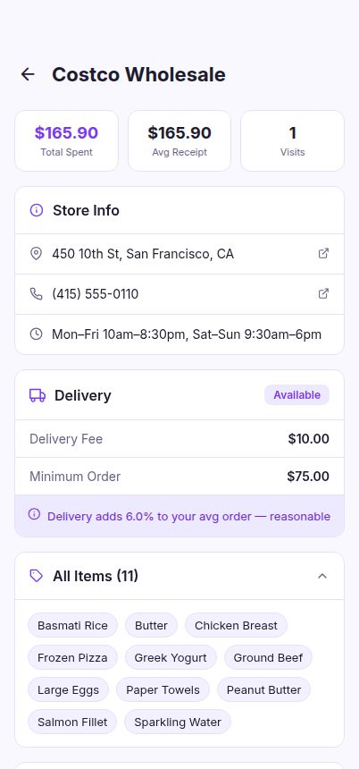

- See total spent, average receipt, and number of visits at a glance.
- The delivery box tells you what percentage the fee adds to a typical order.
- Browse every item you've ever bought at that store.

## 10. Item price history

Tap any item to track its price over time and see which store gave you the best deal.

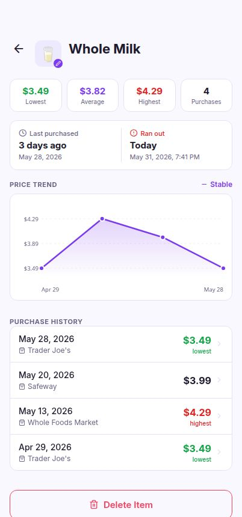

- Lowest, average, and highest prices are summarized up top.
- The price trend chart plots every purchase you've logged.
- Tap the emoji to change it, or use Delete Item to remove it everywhere.

## 11. Shopping list

Your list builds itself from what you buy. Regulars are things you've purchased 2+ times; One-offs are the rest.

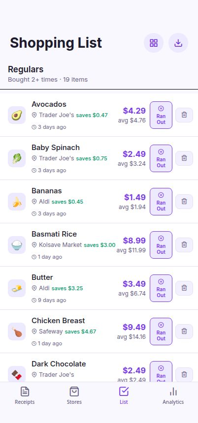

- Each item shows its lowest price, the best store, and how much you save.
- Mark something Ran Out to bump it back to the top of your list.
- Use the download button in the header to export a printable PDF grouped by store.

## 12. Spending analytics

The Analytics tab turns your receipts into spending insights so you can spot trends.

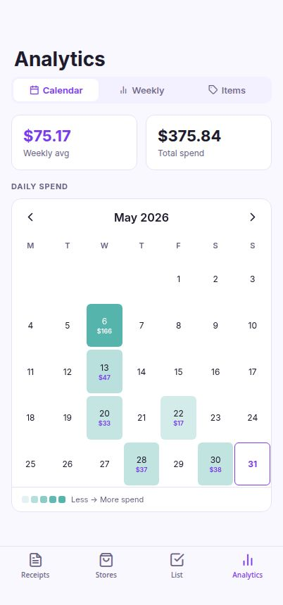

- The calendar heatmap shades each day by how much you spent.
- Switch to Weekly to see spend per week with high/low flags.
- The Items view breaks down price history item by item.

## 13. Browse catalog

Open Browse Catalog from the Shopping List header to see typical prices for items that multiple shoppers have bought, grouped by category.

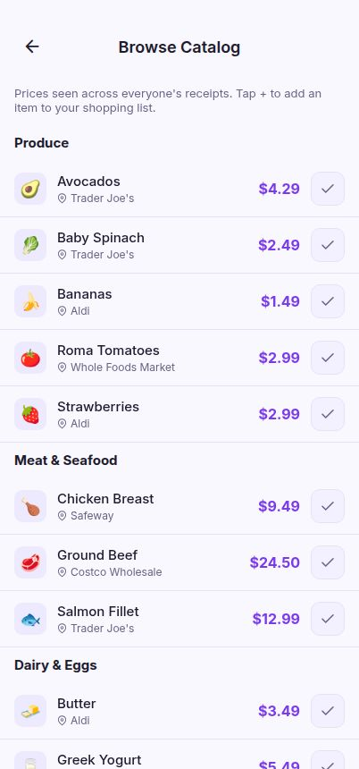

- Tap the + (check) button to add any item to your own shopping list.
- Items already on your list appear checked.
- You only ever see prices for items several shoppers have bought — never who bought them.

## 14. Your account

The Account screen shows who you're signed in as and lets you sign out.

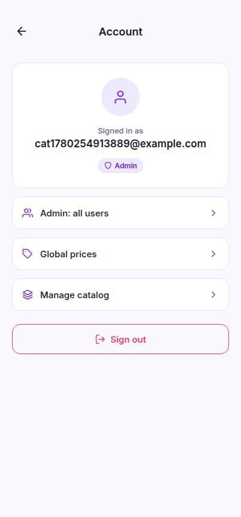

- Confirm the email tied to your data.
- Everything you scan stays private to your account.
- Sign out here to switch accounts.

---

_Generated for TimetoPay. Screenshots reflect the live app with demo data._
