# TimetoPay — How-to Guide

> Scan receipts, track prices over time, and let your shopping list build itself. This guide walks through every part of TimetoPay with screenshots from the app.

---

## 1. Signing in

TimetoPay keeps each person's data private, so you start by signing in. Your receipts, stores, and prices are only ever visible to your own account.

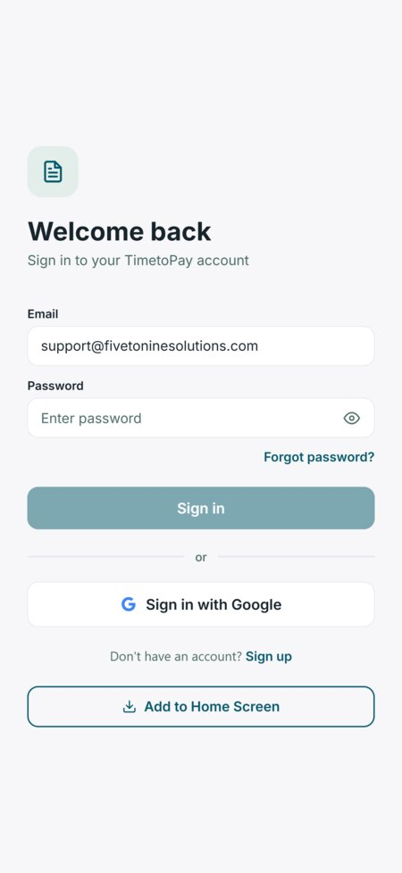

- Enter your email and password, then tap Sign in.
- New here? Tap Sign up to create an account in a few seconds.
- You can sign out any time from the Account screen to switch accounts.

## 2. The Home screen

TimetoPay opens on a hub, not a list. Scan a receipt in one tap, or jump straight to any other part of the app.

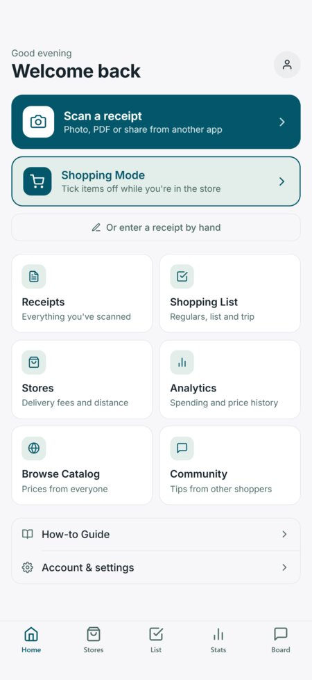

- Tap Scan a receipt (or Shopping Mode, if it's showing) to jump straight into either.
- The six tiles below — Receipts, Shopping List, Stores, Analytics, Browse Catalog, and Community — take you anywhere else in one tap.
- The tab bar at the bottom always has Home, Stores, List, Stats, and Board; Receipts and Account live one tap from Home.

## 3. Your receipts

Every receipt you scan or enter shows up on the Receipts screen, newest first, with the store and total.

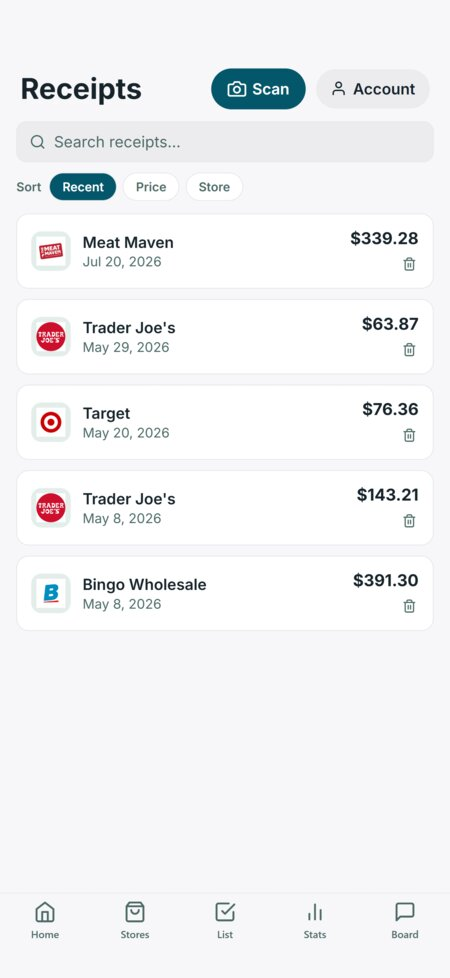

- Tap any receipt to open it and see the individual line items.
- The total on the right is calculated from the items on that receipt.
- Use the search box and Sort control at the top to find or reorder your receipts.
- Use the trash icon to remove a receipt you no longer need.

## 4. Receipt details

Open a receipt to review what was bought. This is where you fix anything the scanner misread.

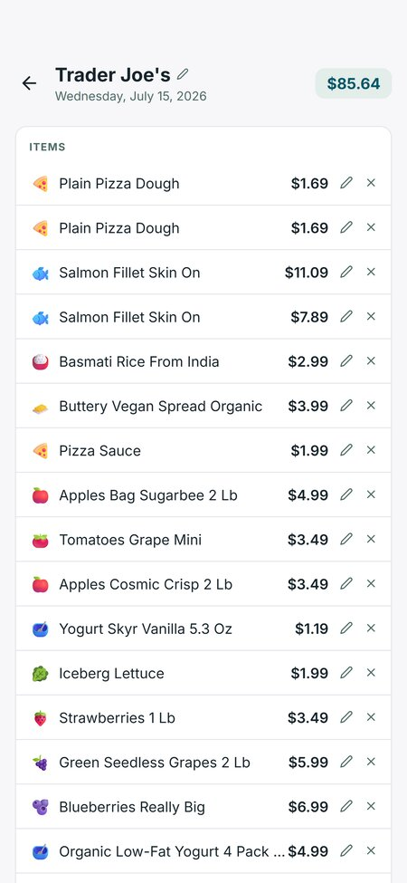

- Tap the pencil on a line to edit its name or price.
- Tap the × to delete a single item from the receipt.
- Each item carries an emoji and feeds your price history automatically.

## 5. Adding a receipt

Tap Scan (or Add Receipt) to capture a new purchase. AI reads the store, items, and prices for you.

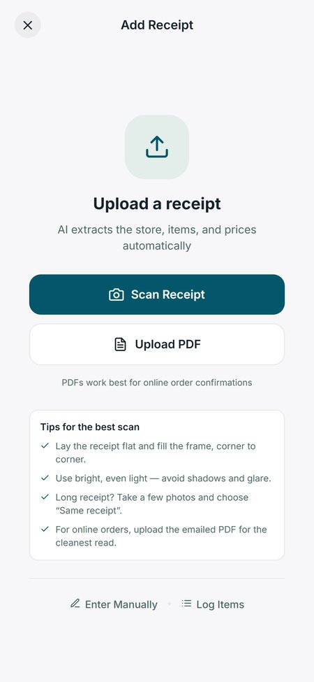

- Choose Photo to snap or upload a paper receipt — the AI extracts everything.
- Upload PDF works best for online order confirmations.
- Prefer to type? Use Enter Manually for a full receipt or Log Items for a quick list.

## 6. Review & save a scan

After the AI reads a photo or PDF, you land on the Review screen to confirm everything before it's saved. Anything the AI wasn't sure about is highlighted in amber.

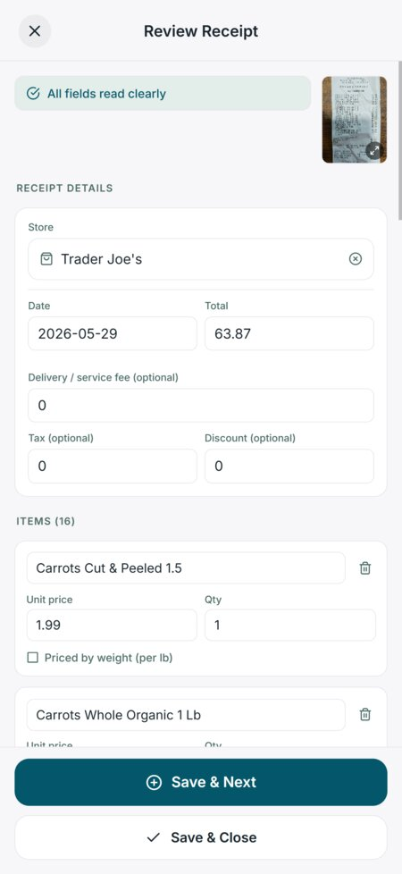

- Check the store, date, and total at the top, then fix any highlighted fields.
- Edit item names, prices, and quantities; remove a line with the trash icon or add one with Add Item.
- Tap Confirm & Save to file the receipt and update your prices and shopping list.

## 7. Enter a receipt manually

No photo? Choose Enter Manually to type a full receipt yourself — handy for cash purchases or older receipts.

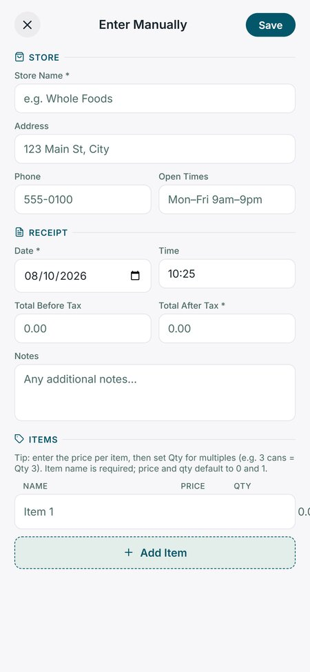

- Fill in the store details and the receipt date, time, and totals.
- Add each item with its name, price, and quantity using Add Item.
- Tap Save to file it just like a scanned receipt.

## 8. Quickly log items

Log Items is the fastest way to jot down a few things — just a store, a date, and a short list. The total adds itself up as you go.

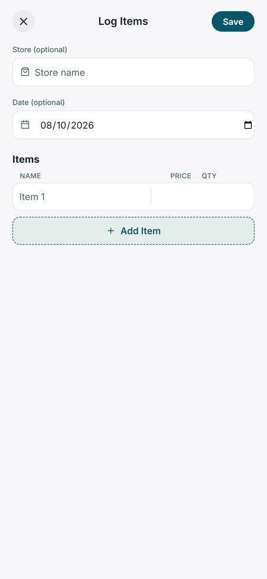

- Start typing a store name and pick from the suggestions, or enter a new one.
- Add each item with its price and quantity; the running total updates live.
- Tap Save to turn the list into a receipt.

## 9. Stores

The Stores tab keeps the places you shop, along with delivery fees and minimum-order details.

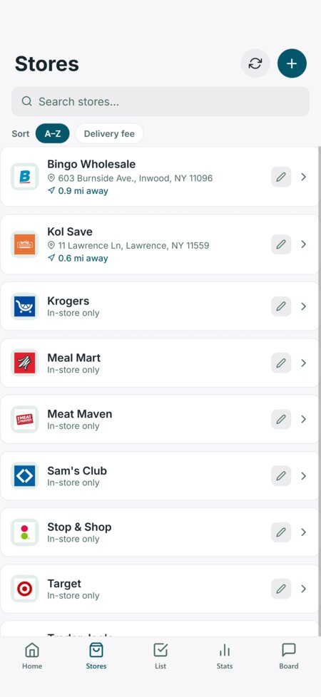

- Tap + to add a store, or the pencil to edit one.
- Record delivery fee and minimum order to power the cost-benefit analysis.
- Tap a store card to open its detail screen.

## 10. Store cost-benefit

Each store's detail screen shows how much you spend there and whether delivery is worth it.

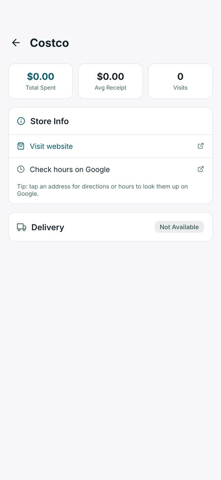

- See total spent, average receipt, and number of visits at a glance.
- The delivery box tells you what percentage the fee adds to a typical order.
- Browse every item you've ever bought at that store.

## 11. Item price history

Tap any item to track its price over time and see which store gave you the best deal.

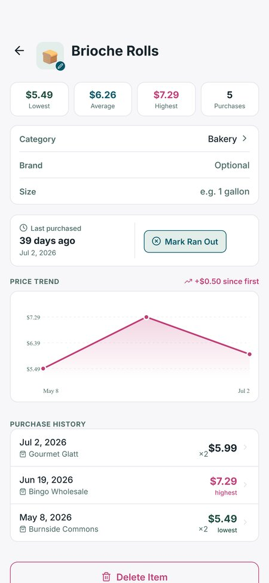

- Lowest, average, and highest prices are summarized up top.
- The price trend chart plots every purchase you've logged.
- Tap the emoji to change it, or use Delete Item to remove it everywhere.

## 12. Shopping list

The Shopping List screen has three sub-tabs: Items (your list), Create list (what to bring today), and Shopping (checking things off in the store). Your list builds itself from what you buy — Regulars are things you've purchased 2+ times; One-offs are the rest.

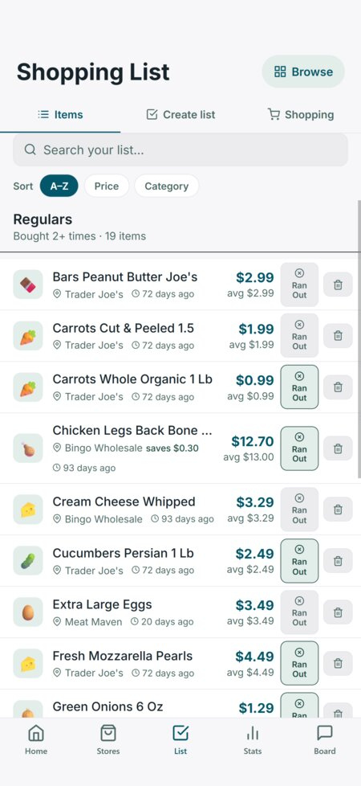

- In Items, each entry shows its lowest price, the best store, and how much you save. Mark something Ran Out to bump it back to the top.
- In Create list, pick which items to bring, merge near-duplicate names, and add anything one-off with the custom-item field.
- Tap Share or PDF in Create list to export it, grouped by store, category, or A–Z.

## 13. Shopping Mode

Switch to the Shopping sub-tab while you're actually in the store. It groups your list by store with big checkboxes, a running total, and nothing else to distract you.

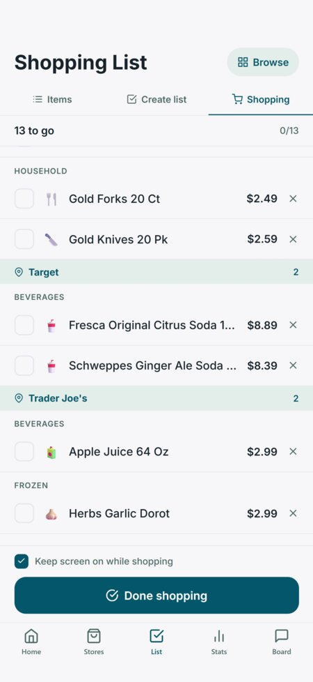

- Tick items off as they go in your cart — the total updates as you go.
- Turn on Keep screen on so the display doesn't lock mid-trip.
- Tap Done shopping when you're finished. Anything still ticked is no longer "ran out," and this is the only thing that starts the reminder clock if you don't log a receipt afterward.

## 14. Spending analytics

The Analytics tab turns your receipts into spending insights so you can spot trends. It has two sub-tabs: Calendar and Items.

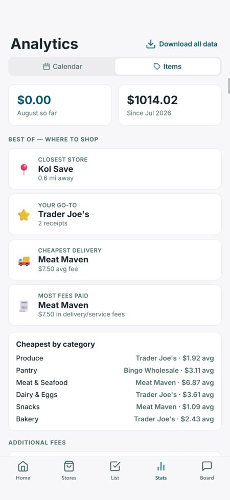

- Calendar shades each day by how much you spent, and shows a recommended weekly budget based on your recent average.
- Items breaks down price history item by item, plus "Best of" cards for your go-to store, cheapest delivery, and cheapest store per category.
- Tap a day or an item to see the detail behind the number.

## 15. Browse catalog

Open Browse Catalog from the Shopping List header to see typical prices for items that multiple shoppers have bought, grouped by category.

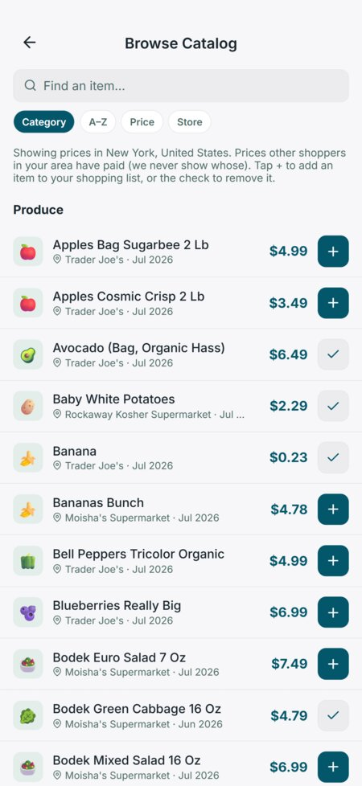

- Tap the + (check) button to add any item to your own shopping list.
- Items already on your list appear checked.
- You only ever see prices for items several shoppers have bought — never who bought them.

## 16. Community Board

The Board is where shoppers post tips, deals, and recipes. Posting takes a couple of receipts uploaded first, and every post is reviewed before it appears.

- Tap Community from the Home hub to read posts, or write your own — new posts go to a moderator first.
- Tap Agree or Thanks on a post, or add a reply.
- If something breaks the rules, tap the ⋯ menu and choose Report. To stop seeing someone entirely, choose Block instead — it takes effect immediately, and you can undo it from Account → Blocked accounts.

## 17. Your account

The Account screen shows who you're signed in as, your region, and your notification and privacy settings.

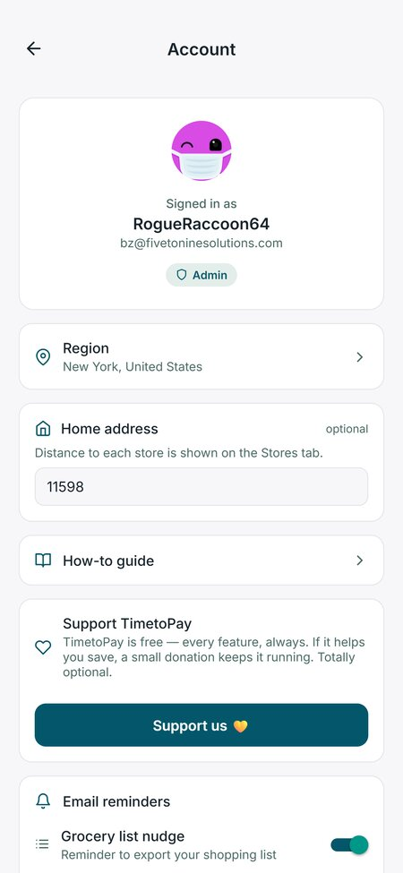

- Confirm the email tied to your data, and set your country/state so catalog prices match your area.
- Add a home address (optional) to see distance to each store — everything you scan stays private to your account either way.
- Sign out here to switch accounts.

---

_Generated for TimetoPay. Screenshots reflect the live app with demo data._
